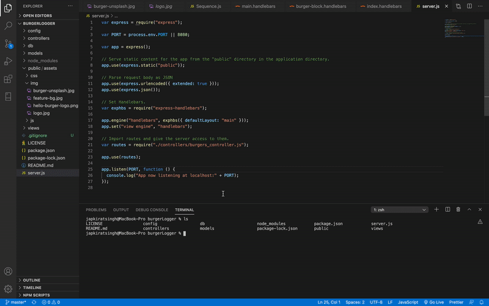

# Burger-Logger

Eat-Da-Burger! is a restaurant app that lets users input the names of burgers they'd like to eat.

## Preview

## Video Guide

![Burger-loggerGIF] (./usage.mov)

## Getting Started

Download zip file or Git Clone repository will get you a copy of the project up and running on your local machine for development and testing purposes.

### Setup and Execution

- npm install

## Built With

### Code Organisation

- [MVC](https://en.wikipedia.org/wiki/Model%E2%80%93view%E2%80%93controller) - Stands for Model-View-Controller, an architectural pattern commonly used for developing user interfaces

### Text Editor

- [Visual Studio Code](https://code.visualstudio.com/)

### Back-end

- [MySQL](https://www.mysql.com/) - Database management system

- [Handlebars](https://handlebarsjs.com/) - Build semantic templates effectively
- [exphbs](https://www.npmjs.com/package/express-handlebars) - Makes view engine for Express not suck
- [ORM](https://en.wikipedia.org/wiki/Object-relational_mapping) - Stands for Object-Relational-Mapping, query and manipulate data from a database using an object-oriented paradigm
- [JavaScript](http://www.dropwizard.io/1.0.2/docs/) - Language used
- [jQuery](https://jquery.com/) - JavaScript library
- [Node.js](https://nodejs.org/en/) - Command-line applications
- [Express.js](https://www.npmjs.com/package/express) - Fast, unopinionated, minimalist web framework for node
- [NPM](https://www.npmjs.com/) - JS library management
- [Heroku](https://www.heroku.com/) - Deploy assignment platform
- [GitHub](https://www.github.com/) - Web-based hosting service for version control using Git

### Front-end

- [HTML](https://www.w3schools.com/html/html_intro.asp) - Markup language for creating Web pages
- [CSS](https://www.w3schools.com/css/css_intro.asp) - Describes how HTML elements are to be displayed, styling and responsiveness
- [Bootstrap](https://getbootstrap.com/) - Build responsive, mobile-first projects on the web
- [Font Awesome](https://fontawesome.com/) - Vector icons and social logos on your website
- [Google Fonts](https://fonts.google.com/) - Library of fonts

## Author

- **Japkirat Singh** - _Eat-Da-Burger_ - [xmkchen](https://github.com/JAPKIRAT96/burgerLogger.git)

## License

This project is licensed under the MIT License
